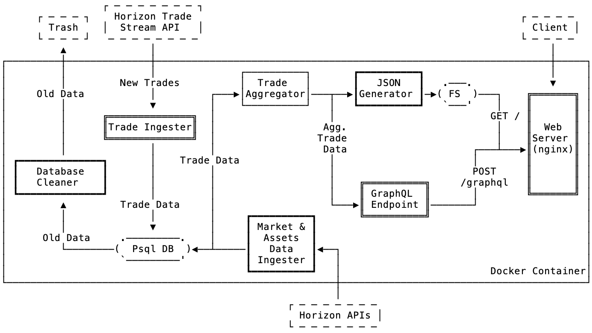

# Stellar Ticker

This project aims to provide an easy-to-deploy Stellar ticker to replace http://ticker.stellar.org.

## Architecture

The proposed solution consists of a set of tasks (which run according to a time schedule) and some services (which run continuously, as daemons) that are put together in order to provide a ticker (via https://ticker.stellar.org) that is highly available and provide data as fresh as possible.

The setup and tools used are focused on creating an environment that is easy to replicate and doesn't depend on AWS specific services, so that Stellar users / developers can easily deploy a ticker of their own if they want. All code created should be open-sourced.

The following diagram illustrates the proposed services, tasks, external sources, containers and some of the data flow for the New Stellar ticker:

Here is a quick overview of each of the proposed services, tasks and other components:
- **Trade ingester (service):** connects to the Horizon Trade Stream API in order to stream new trades performed on the Stellar Network and ingest them into the PostgreSQL Database.
- **Market & Assets Data Ingester:** connects to other Horizon APIs to retrieve other important data, such as assets.
- **Trade Aggregator:** provides the logic for querying / aggregating trade and market data from the database and outputting it to either the JSON Generator or the GraphQL server.
JSON Generator: gets the data provided by the trade Aggregator, formats it into the desired JSON format (similar to what we have in http://ticker.stellar.org) and output it to a file.
- **GraphQL Endpoint:** provides a GraphQL interface for users to retrieve aggregated trade data from the Postgres DB.
- **Web Server (nginx):** routes the client requests to either a) serve the JSON file ("/") or forward the request to the GraphQL server ("/graphql").
- **Psql DB:** a PostgreSQL database to store the relational trade / market / asset data.
Database Cleaner: since the Ticker has a limited time range of data, this service can clear old entries so the database doesn't considerably grow its storage usage throughout time.

### Considerations
1. All tasks (Market & Assets Data Ingester, JSON Generator,  Database Cleaner) and services (Trade Ingester, GraphQL Endpoint, Web Server) would run within a single container being supervised by supervisord, similarly to what is done in Horizon – enabling a very simple and fast deployment.
1. We could also split each of the tasks / services into separate containers and orchestrate them, but this might defeat the purpose of making it easy to deploy.
1. The Postgres database could run inside the container, or alternatively we could point to an external database and use docker-compose for local development.
1. In this architecture, the output of the JSON Generator is saved in the filesystem, but we could also think about uploading the output to S3 and figure out some smart routing / reverse proxy.
1. CoinMarketCap uses (at least to some degree) ticker.stellar.org to power its Stellar DEX markets page. Ensure that this keeps working. Hopefully that page will even get better by including more markets.

## Roadmap
- [ ] Create the basic infrastructure for the project.
- [ ] Create the database models and the necessary functions to interact with them, as well as the migrations.
- [ ] Create a service that connects to the Horizon Trade Stream API and constantly ingests new trades to the database. If the service has just started, it should also backfill with the freshest trade data.
- [ ] Replicate the services from StellarX that calculate aggregations, find assets from Horizon, etc to provide all means to correctly generate the ticker data.
- [ ] Create a script that generates an output JSON file (in the same format from ticker.stellar.org) every x minutes with the freshest data from the Database (alternatively, always update the JSON file whenever there’s an input from #3), and uploads it to S3 or serve it from the filesystem.
- [ ] Create a task that cleans up old data from the db (e.g. entries older than 7 days).
- [ ] Create a GraphQL endpoint to serve custom ticker data, as the StellarX counterpart does.
- [ ] Encapsulate all these services in a Docker container (that might point to an external Postgres db) and configure supervisord.
- [ ] (Recurring) Add tests.
- [ ] Improve documentation.

## Running the project (beta)
1. Install sql-migrate: `$ go get -v github.com/rubenv/sql-migrate/...`
1. Instal PostgreSQL: `$ brew install postgresql`
1. Edit `dbconfig.yml` to reflect your database configuration.
1. Run migrations `$ sql-migrate up`
1. Run the project `$ DB_INFO="user=<DB_USER> dbname=<DB_NAME> sslmode=disable" go run main.go`
