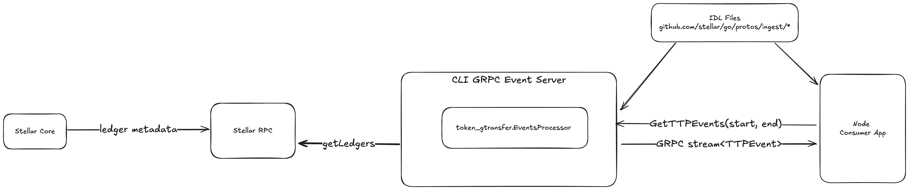

# TTP POC 
example of Token transfer Processor [TTP](../../../ingest/processors/token_transfer/token_transfer_processor.go) as a GRPC server which streams events to a node js application as the grpc consumer.



## in one terminal, run the TTP grpc server

install protoc
- on mac, `brew install protobuf`


Install protoc Go plugins globally, make sure your PATH includes GOPATH/bin or GOBIN 
- `go install google.golang.org/protobuf/cmd/protoc-gen-go@v1.28`
- `go install google.golang.org/grpc/cmd/protoc-gen-go-grpc@v1.2`


build and run the server
```
cd cli_tool
make build-server
RPC_ENDPOINT=https://soroban-testnet.stellar.org NETWORK_PASSPHRASE="Test SDF Network ; September 2015" ./ttp_grpc_server
```

## in another terminal, run an example consumer app
This example is in node, and it builds a grpc client from the protos to connect and consume events from the TTP grpc server
Make sure to have **Node >= 22** installed locally on host
```
cd consumer_app
make build-node
cd node
# run the ts directly
npm start -- <testnet start ledger> <testnet end ledger>
# or run the compiled js
node dist/index.js <testnet start ledger> <testnet end ledger>
```


