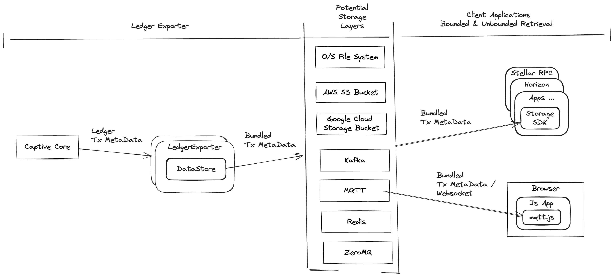

# Galexie Developer Guide
Galexie is a tool to export Stellar network transaction data to cloud storage in a way that is easy to access.

## Prerequisites
This document assumes that you have installed and can run Galexie, and that you have familiarity with its CLI and configuration. If not, please refer to the [Admin Guide](https://developers.stellar.org/docs/data/galexie/admin_guide).

## Goal
The goal of Galexie is to build an easy-to-use tool to export Stellar network ledger data to a configurable remote data store, such as cloud blob storage.
 - Use cloud storage optimally
 - Minimize network usage to export
 - Make it easy and fast to search for a specific ledger or ledger range

## Architecture
To achieve its goals, Galexie uses the following architecture, which consists of the 3 main components:
- Captive-core to extract raw transaction metadata from the Stellar Network.
- Export manager to bundles and organizes the ledgers to get them ready for export.
- The cloud storage plugin writes to the cloud storage. This supports multiple storage backends including Google Cloud Storage (GCS), Amazon S3, and S3-compatible storage services.





## Data Format
- Galexie uses a compact and efficient data format called [XDR](https://developers.stellar.org/docs/learn/encyclopedia/data-format/xdr) (External Data Representation), which is a compact binary format. A Stellar Captive Core instance emits data in this format and the data structure is referred to as `LedgerCloseMeta`. The exporter bundles multiple `LedgerCloseMeta`'s into a single object using a custom XDR structure called `LedgerCloseMetaBatch` which is defined in [Stellar-exporter.x](https://github.com/stellar/go/blob/master/xdr/Stellar-exporter.x).

- The metadata for the same batch is also stored alongside each exported object. Supported metadata is defined in [metadata.go](https://github.com/stellar/go/blob/master/support/datastore/metadata.go). 

- Objects are compressed before uploading using the [zstd](http://facebook.github.io/zstd/) (zstandard) compression algorithm to optimize network usage and storage needs.

## Data Storage
Galexie implements a pluggable data storage architecture through the `DataStore` interface. This plugin is located in the [support](https://github.com/stellar/go/tree/master/support/datastore) package and supports multiple storage backends:

### Google Cloud Storage (GCS)
- The [GCS plugin](https://github.com/stellar/go/blob/master/support/datastore/gcs_datastore.go) uses GCS-specific behaviors like conditional puts, automatic retry, metadata, and CRC checksum validation.

### Amazon S3 and S3-Compatible Storage
- The [S3 plugin](https://github.com/stellar/go/blob/master/support/datastore/s3_datastore.go) supports AWS S3 and S3-compatible storage services such as:
  - Amazon S3
  - Cloudflare R2
  - MinIO
  - DigitalOcean Spaces
  - Any other S3-compatible object storage
- Features include conditional puts using `If-None-Match` headers, metadata storage, CRC32C checksum validation, and automatic retry mechanisms.

## Build and Run using Docker
The Dockerfile contains all the necessary dependencies (e.g., Stellar-core) required to run Galexie.

- Build: To build the Docker container, use the provided [Makefile](./Makefile). Simply run make `make docker-build` to build a new container after making any changes.

- Run: For instructions on running the Docker container, refer to the [Installation Guide](./README.md).

- Run Galexie with a local, fake GCS backend: Requires `make docker-build` first, then run `make docker-test-fake-gcs`. This will run it against `testnet` and export to the 'fake' GCS instance started in the container.

## Running Integration Tests:
from top directory of stellar/go repo, run go test to launch Galexie integration
tests.

`GALEXIE_INTEGRATION_TESTS_ENABLED=true` is required environment variable to allow
tests to run.

Optional, tests will try to run `stellar-core` from o/s PATH for captive core, if not resolvable, then set `GALEXIE_INTEGRATION_TESTS_CAPTIVE_CORE_BIN=/path/to/stellar-core`

Optional, can override the version of quickstart used to run standalone stellar network, `GALEXIE_INTEGRATION_TESTS_QUICKSTART_IMAGE=docker.io/stellar/quickstart:<tag>`. By default it will try to docker pull `stellar/quickstart:testing` image to local host's docker image store. Set `GALEXIE_INTEGRATION_TESTS_QUICKSTART_IMAGE_PULL=false` to skip the pull, if you know host has up to date image.

Note, the version of stellar core in `GALEXIE_INTEGRATION_TESTS_QUICKSTART_IMAGE` and `GALEXIE_INTEGRATION_TESTS_CAPTIVE_CORE_BIN` needs to be on the same major rev or the captive core process may not be able to join or parse ledger meta from the `local` network created by `GALEXIE_INTEGRATION_TESTS_QUICKSTART_IMAGE`

```
$ GALEXIE_INTEGRATION_TESTS_ENABLED=true go test -v -race -run TestGalexieGCSTestSuite ./services/galexie/...
$ GALEXIE_INTEGRATION_TESTS_ENABLED=true go test -v -race -run TestGalexieS3TestSuite ./services/galexie/...
```

## Adding support for a new storage type
Support for different data storage types are encapsulated as 'plugins', which are implementation of `DataStore` interface in a go package. To add a data storage plugin based on a new storage type, follow these steps:

- A data storage plugin must implement the [DataStore](https://github.com/stellar/go/blob/master/support/datastore/datastore.go) interface.
- Add support for new datastore-specific features. Implement any datastore-specific custom logic. Different datastores have different ways of handling 
  - race conditions
  - automatic retries
  - metadata storage, etc.
- Add the new datastore to the factory function [NewDataStore](https://github.com/stellar/go/blob/master/support/datastore/datastore.go).
- Add a [config](./config.example.toml) section for the new storage type. This may include configurations like destination, authentication information etc.
- An emulator such as a GCS emulator [fake-gcs-server](https://github.com/fsouza/fake-gcs-server) can be used for testing without connecting to real cloud storage.

### Design DOs and DONTs
- Multiple Galexie instances should be able to run in parallel without the need for explicit locking or synchronization.
- Exporters when restarted do not have any memory of prior operation and rely on the already exported data as much as possible to decide where to resume.

## Using exported data
The exported data in storage can be used in the ETL pipeline to gather analytics and reporting. To write a tool that consumes exported data you can use Stellar ingestion library's `ledgerbackend` package. This package includes a ledger backend called [BufferedStorageBackend](https://github.com/stellar/go/blob/master/ingest/ledgerbackend/buffered_storage_backend.go),
which imports data from the storage and validates it. For more details, refer to the ledgerbackend [documentation](https://github.com/stellar/go/tree/master/ingest/ledgerbackend).

## Contributing
For information on how to contribute, please refer to our [Contribution Guidelines](https://github.com/stellar/go/blob/master/CONTRIBUTING.md).
