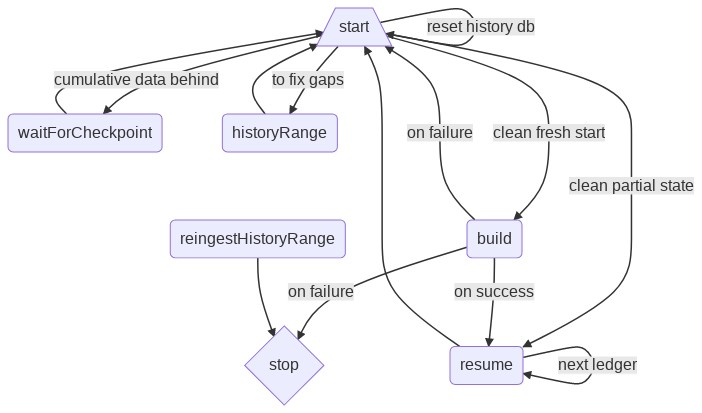

# Ingestion Finite State Machine
The following states are possible:
  - `start`
  - `stop`
  - `build`
  - `resume`
  - `verifyRange`
  - `historyRange`
  - `reingestHistoryRange`
  - `waitForCheckpoint`

There is also the `stressTest` state, but that exists in its own world and is used only for testing ingestion, as its name implies.

#### Definitions
There are some important terms that need to be defined for clarity as they're used extensively in both the codebase and this breakdown:

  - the `historyQ` member provides an interface into both the **historical** data (*time-series*) as well as the **state** data (*cumulative*) in the database and does not refer to the history archives
  - the `lastIngestedLedger` thus corresponds to the last ledger that Horizon fully ingested into the database (both time-series and cumulative data)
  - the `lastHistoryLedger`, however, corresponds to the last ledger that Horizon ingested *only* into the time-series tables (coming from `history_ledgers` table); this can be not-equal to the `lastIngestedLedger` because time-series data can be ingested independently of cumulative data (via the `db reingest range` subcommand). I'll usually refer to it as the `lastKnownLedger`
  - the `lastCheckpoint` corresponds to the last checkpoint ledger (reminder: a checkpoint ledger is one in which: `(ledger# + 1) mod 64 == 0`) and thus to a matching history archive upload.

One of the most important jobs of the FSM described here is to make sure that `lastIngestedLedger` and `lastHistoryLedger` are equal: the [`historyRange`](#historyrange-state) updates the latter, but not the former, so that we can track when state data is behind history data.

In general, only one node should ever be writing to a database at once, globally. Hence, there are a few checks at the start of most states to ensure this.



(The above diagram was generated using [this Mermaid definition](https://mermaid-js.github.io/mermaid-live-editor/#/edit/eyJjb2RlIjoiZ3JhcGggVERcbiAgICBBWy9zdGFydFxcXSAtLSBjdW11bGF0aXZlIGRhdGEgYmVoaW5kIC0tPiBCKHdhaXRGb3JDaGVja3BvaW50KVxuICAgIEIgLS0-IEFcbiAgICBBIC0tIHRvIGZpeCBnYXBzIC0tPiBDKGhpc3RvcnlSYW5nZSlcbiAgICBDIC0tPiBBXG4gICAgQSAtLSBjbGVhbiBmcmVzaCBzdGFydCAtLT4gRChidWlsZClcbiAgICBBIC0tIGNsZWFuIHBhcnRpYWwgc3RhdGUgLS0-IEUocmVzdW1lKVxuICAgIEEgLS0gcmVzZXQgaGlzdG9yeSBkYiAtLT4gQVxuICAgIEQgLS0gb24gZmFpbHVyZSAtLS0-IEFcbiAgICBEIC0tIG9uIGZhaWx1cmUgLS0-IEZ7c3RvcH1cbiAgICBEIC0tIG9uIHN1Y2Nlc3MgLS0-IEVcbiAgICBFIC0tIG5leHQgbGVkZ2VyIC0tPiBFXG4gICAgRSAtLT4gQVxuICAgIEcocmVpbmdlc3RIaXN0b3J5UmFuZ2UpIC0tPiBGIiwibWVybWFpZCI6eyJ0aGVtZSI6ImRlZmF1bHQiLCJmbG93Y2hhcnQiOnsiY3VydmUiOiJiYXNpcyJ9LCJ0aGVtZVZhcmlhYmxlcyI6eyJiYWNrZ3JvdW5kIjoid2hpdGUiLCJwcmltYXJ5Q29sb3IiOiIjRUNFQ0ZGIiwic2Vjb25kYXJ5Q29sb3IiOiIjZmZmZmRlIiwidGVydGlhcnlDb2xvciI6ImhzbCg4MCwgMTAwJSwgOTYuMjc0NTA5ODAzOSUpIiwicHJpbWFyeUJvcmRlckNvbG9yIjoiaHNsKDI0MCwgNjAlLCA4Ni4yNzQ1MDk4MDM5JSkiLCJzZWNvbmRhcnlCb3JkZXJDb2xvciI6ImhzbCg2MCwgNjAlLCA4My41Mjk0MTE3NjQ3JSkiLCJ0ZXJ0aWFyeUJvcmRlckNvbG9yIjoiaHNsKDgwLCA2MCUsIDg2LjI3NDUwOTgwMzklKSIsInByaW1hcnlUZXh0Q29sb3IiOiIjMTMxMzAwIiwic2Vjb25kYXJ5VGV4dENvbG9yIjoiIzAwMDAyMSIsInRlcnRpYXJ5VGV4dENvbG9yIjoicmdiKDkuNTAwMDAwMDAwMSwgOS41MDAwMDAwMDAxLCA5LjUwMDAwMDAwMDEpIiwibGluZUNvbG9yIjoiIzMzMzMzMyIsInRleHRDb2xvciI6IiMzMzMiLCJtYWluQmtnIjoiI0VDRUNGRiIsInNlY29uZEJrZyI6IiNmZmZmZGUiLCJib3JkZXIxIjoiIzkzNzBEQiIsImJvcmRlcjIiOiIjYWFhYTMzIiwiYXJyb3doZWFkQ29sb3IiOiIjMzMzMzMzIiwiZm9udEZhbWlseSI6IlwidHJlYnVjaGV0IG1zXCIsIHZlcmRhbmEsIGFyaWFsIiwiZm9udFNpemUiOiIxNnB4IiwibGFiZWxCYWNrZ3JvdW5kIjoiI2U4ZThlOCIsIm5vZGVCa2ciOiIjRUNFQ0ZGIiwibm9kZUJvcmRlciI6IiM5MzcwREIiLCJjbHVzdGVyQmtnIjoiI2ZmZmZkZSIsImNsdXN0ZXJCb3JkZXIiOiIjYWFhYTMzIiwiZGVmYXVsdExpbmtDb2xvciI6IiMzMzMzMzMiLCJ0aXRsZUNvbG9yIjoiIzMzMyIsImVkZ2VMYWJlbEJhY2tncm91bmQiOiIjZThlOGU4IiwiYWN0b3JCb3JkZXIiOiJoc2woMjU5LjYyNjE2ODIyNDMsIDU5Ljc3NjUzNjMxMjglLCA4Ny45MDE5NjA3ODQzJSkiLCJhY3RvckJrZyI6IiNFQ0VDRkYiLCJhY3RvclRleHRDb2xvciI6ImJsYWNrIiwiYWN0b3JMaW5lQ29sb3IiOiJncmV5Iiwic2lnbmFsQ29sb3IiOiIjMzMzIiwic2lnbmFsVGV4dENvbG9yIjoiIzMzMyIsImxhYmVsQm94QmtnQ29sb3IiOiIjRUNFQ0ZGIiwibGFiZWxCb3hCb3JkZXJDb2xvciI6ImhzbCgyNTkuNjI2MTY4MjI0MywgNTkuNzc2NTM2MzEyOCUsIDg3LjkwMTk2MDc4NDMlKSIsImxhYmVsVGV4dENvbG9yIjoiYmxhY2siLCJsb29wVGV4dENvbG9yIjoiYmxhY2siLCJub3RlQm9yZGVyQ29sb3IiOiIjYWFhYTMzIiwibm90ZUJrZ0NvbG9yIjoiI2ZmZjVhZCIsIm5vdGVUZXh0Q29sb3IiOiJibGFjayIsImFjdGl2YXRpb25Cb3JkZXJDb2xvciI6IiM2NjYiLCJhY3RpdmF0aW9uQmtnQ29sb3IiOiIjZjRmNGY0Iiwic2VxdWVuY2VOdW1iZXJDb2xvciI6IndoaXRlIiwic2VjdGlvbkJrZ0NvbG9yIjoicmdiYSgxMDIsIDEwMiwgMjU1LCAwLjQ5KSIsImFsdFNlY3Rpb25Ca2dDb2xvciI6IndoaXRlIiwic2VjdGlvbkJrZ0NvbG9yMiI6IiNmZmY0MDAiLCJ0YXNrQm9yZGVyQ29sb3IiOiIjNTM0ZmJjIiwidGFza0JrZ0NvbG9yIjoiIzhhOTBkZCIsInRhc2tUZXh0TGlnaHRDb2xvciI6IndoaXRlIiwidGFza1RleHRDb2xvciI6IndoaXRlIiwidGFza1RleHREYXJrQ29sb3IiOiJibGFjayIsInRhc2tUZXh0T3V0c2lkZUNvbG9yIjoiYmxhY2siLCJ0YXNrVGV4dENsaWNrYWJsZUNvbG9yIjoiIzAwMzE2MyIsImFjdGl2ZVRhc2tCb3JkZXJDb2xvciI6IiM1MzRmYmMiLCJhY3RpdmVUYXNrQmtnQ29sb3IiOiIjYmZjN2ZmIiwiZ3JpZENvbG9yIjoibGlnaHRncmV5IiwiZG9uZVRhc2tCa2dDb2xvciI6ImxpZ2h0Z3JleSIsImRvbmVUYXNrQm9yZGVyQ29sb3IiOiJncmV5IiwiY3JpdEJvcmRlckNvbG9yIjoiI2ZmODg4OCIsImNyaXRCa2dDb2xvciI6InJlZCIsInRvZGF5TGluZUNvbG9yIjoicmVkIiwibGFiZWxDb2xvciI6ImJsYWNrIiwiZXJyb3JCa2dDb2xvciI6IiM1NTIyMjIiLCJlcnJvclRleHRDb2xvciI6IiM1NTIyMjIiLCJjbGFzc1RleHQiOiIjMTMxMzAwIiwiZmlsbFR5cGUwIjoiI0VDRUNGRiIsImZpbGxUeXBlMSI6IiNmZmZmZGUiLCJmaWxsVHlwZTIiOiJoc2woMzA0LCAxMDAlLCA5Ni4yNzQ1MDk4MDM5JSkiLCJmaWxsVHlwZTMiOiJoc2woMTI0LCAxMDAlLCA5My41Mjk0MTE3NjQ3JSkiLCJmaWxsVHlwZTQiOiJoc2woMTc2LCAxMDAlLCA5Ni4yNzQ1MDk4MDM5JSkiLCJmaWxsVHlwZTUiOiJoc2woLTQsIDEwMCUsIDkzLjUyOTQxMTc2NDclKSIsImZpbGxUeXBlNiI6ImhzbCg4LCAxMDAlLCA5Ni4yNzQ1MDk4MDM5JSkiLCJmaWxsVHlwZTciOiJoc2woMTg4LCAxMDAlLCA5My41Mjk0MTE3NjQ3JSkifX19).)


#### Tables
Within the Horizon database, there are a number of tables touched by ingestion that are worth differentiating explicitly. With these in mind, the subsequently-described states and their respective operations should be much clearer.

The database contains:

  - **History tables** -- all tables that contain historical time-series data, such as `history_transactions`, `history_operations`, etc.
  - **Transaction processors** -- processors that ingest the history tables (described by the `io.LedgerTransaction` interface).
  - **State tables** -- all tables that contain the current cumulative state, such as accounts, offers, etc.
  - **Change processors** -- processors ingesting deltas update state tables. These aren't related to a particular *transaction*, but rather describe a *transition* of a ledger entry from one state to another (described by the `io.Change` interface). This can take the form of both tx meta (time-series data, where the "change" occurs from one ledger to the next) and history archives (cumulative data, where the "change" occurs from the genesis ledger to the checkpoint).


## `start` State 
As you might expect, this state kicks off the FSM process.

There are a few possible branches in this state.

##### DB upgrade or fresh start
The "happiest path" is the following: either the ingestion database is empty, so we can start purely from scratch, or the state data in a database is outdated, meaning it needs to be upgraded and so can effectively be started from scratch after catch-up.

This branches differently depending on the last known ledger:

  - If it's newer than the last checkpoint, we need to wait for a new checkpoint to get the latest cumulative data. Note that though we probably *could* make incremental changes from block to block to the cumulative data, that would be more effort than it's worth relative to just waiting on the next history archive to get dumped. **Next state**: [`waitForCheckpoint`](#waitforcheckpoint-state).

  - If it's older, however, then we can just grok the missing gap (i.e. until the *latest* checkpoint) and build up (only) the time-series data. **Next state**: [`historyRange`](#historyrange-state).

In the other cases (matching last-known and last-checkpoint ledger, or no last-known), **next state**: [`build`](#build-state).

##### Otherwise
If we can't have a clean slate to work with, we need to fix partial state. Specifically,

  - If the last-known ledger is ahead of the last-ingested ledger, then Horizon's cumulative state data is behind its historical time-series data in the database. Here, we'll reset the time-series DB and start over. **Next state**: [`start`](#start-state), with `lastIngestedLedger == 0`.

  - If the time-series database is newer than the last-known ledger (can occur if ingestion was done for a different range earlier, for example), then Horizon needs to become aware of the missing ledgers. **Next state**: [`historyRange`](#historyrange-state) from "last known" to "last stored" in time-series db.

**Next state**: [`resume`](#resume-state)


## `build` state
This is the big kahuna of the state machine: there aren't many state transitions aside from success/failure, and all roads ultimately should lead to ~~Rome~~ `build` in order to get ingestion done. This state only establishes a baseline for the cumulative data, though.


### Properties
This state tracks the:

  - `checkpointLedger`, which is Horizon's last-known (though possibly-unprocessed) checkpoint ledger, and 
  - `stop`, which optionally (though *universally*) transitions to the [`stop`](#stop-state) after this state is complete.

### Process
If any of the checks (incl. the aforementioned sync checks) fail, we'll move to the [`start` state](#start-state). Sometimes, though, we want to [`stop`](#stop-state), instead (see `buildState.stop`).

The actual ingestion involves a few steps:

   - turn a checkpoint's history archive into cumulative db data
   - update the ingestion database's version 
   - update the last-ingested ledger in the time-series db
   - commit to the ingestion db

These are detailed later, in the [Ingestion](#ingestion) section. Suffice it to say that at the end of this state, either we've errored out (described above), stopped (on error **or** success, if `buildState.stop` is set), or [`resume`](#resume-state)d from the checkpoint ledger.


## `resume` state
This state ingests time-series data for a single ledger range, then loops back to itself for the next ledger range.


### Properties
This state just tracks one thing:

  - `latestSuccessfullyProcessedLedger`, whose name should be self-explanatory: this indicates the highest ledger number to be ingested.

### Process
First, note the difference between `resumeState.latestSuccessfullyProcessedLedger` and the queried `lastIngestedLedger`: one of these is tied to the state machine, while the other is associated with the actual time-series database. 

The following are problematic error conditions:

  - the former is larger than the latter
  - the versions (of the DB and current ledgers) mismatch
  - the last-known ledger of the time-series db doesn't match the last-ingested ledger
  - **Next state**: [`start`](#start-state).

Otherwise, we have `ingestLedger == lastIngestedLedger + 1`, and will proceed to process the range from `ingestLedger` onward.

With the range prepared, only one other primary state transition is possible. If the last-known ledger of the Core backend is outdated relative to the above `ingestLedger`, we'll block until the requisite ledger is seen and processed by Core. **Next state**: [`resume`](#resume-state) again, with the last-processed ledger set to whatever is last-known to Core.

Otherwise, we can actually turn the ledger into time-series data: this is exactly the responsibility of `RunAllProcessorsOnLedger` and all of its subsequent friends. The deltas for the ledger(s) are ingested into the time-series db, then verified.

**Next state**: [`resume`](#resume-state) again, except now targeting the *next* ledger.


## `historyRange` state
The purpose of this state is to ingest a particular ledger range into the cumulative database. Since the next state will be [start](#start-state), we will be rebuilding state in the future anyway.

### Properties
This tracks an inclusive ledger range: [`fromLedger`, `toLedger`].

**Next state**: [`start`](#start-state)


## `reingestHistoryRange` state
This state acts much like the [`historyRange` state](#historyrange-state).

**Next state**: [`stop`](#stop-state)

### Properties
This tracks an inclusive ledger range: [`fromLedger`, `toLedger`], as well as a `force` flag that will override certain restrictions.


## `waitForCheckpoint` state
This pauses the state machine for 10 seconds then tries again, in hopes that a new checkpoint ledger has been created (remember, checkpoints occur every 64 ledgers).

**Next state**: [`start`](#start-state)


# Reingestion
Horizon supports running reingestion by executing a sub command `db reingest range <from_ledger> <to_ledger>` which will execute as an o/s process and will be synchronous, exiting the process only after the complete reingestion range is finished or an error is encountered.

By default this sub-command will attempt to use captive core configuration in the form of stellar core binary(`--stellar-core-binary-path`) and stellar core config(`--captive-core-config-path`) to obtain ledger tx meta from a stellar network to be ingested. 

The `db reingest range` sub-command can optionally be configured to consume pre-computed ledger tx meta files from a Google Cloud Storage(GCS) location instead of running captive core on host machine. 
Pre-requirements: 
  - Have a GCS account.
  - Run the [ledgerexporter] to publish ledger tx meta files to your GCS bucket location.
Run the `db reingest` sub-command, configured to import tx meta from your GCS bucket:
  ```$ DATABASE_URL=<your db host dsn> \
     NETWORK=testnet \
     stellar-horizon db reingest range \
		   --parallel-workers 2 \
		   --ledgerbackend "datastore" \
		   --datastore-config "config.storagebackend.toml" \
       100 200
  ```  
Notice, even though we no longer need to provide stellar-core related config for binary or config file, we do still need to provide network related config, using convenience parameter `NETWORK=testnet|pubnet` or directly with `NETWORK_PASSPHRASE` and `HISTORY_ARCHIVE_URLS`

The `--datastore-config` must point to a new toml config file that will provide the necessary parameters for ingestion to work with remote GCS storage.

example config toml:
```
# Datastore Configuration
[datastore_config]
# Specifies the type of datastore. 
# Currently, only Google Cloud Storage (GCS) is supported.
type = "GCS"

[datastore_config.params]
# The Google Cloud Storage bucket path for storing data, with optional subpaths for organization.
destination_bucket_path = "path/to/my/bucket"

[datastore_config.schema]
# Configuration for data organization of the remote files
ledgers_per_file = 1          # Number of ledgers stored in each file.
files_per_partition = 64000   # Number of files per partition/directory.

```

# Range Preparation
TODO: See `maybePrepareRange`
